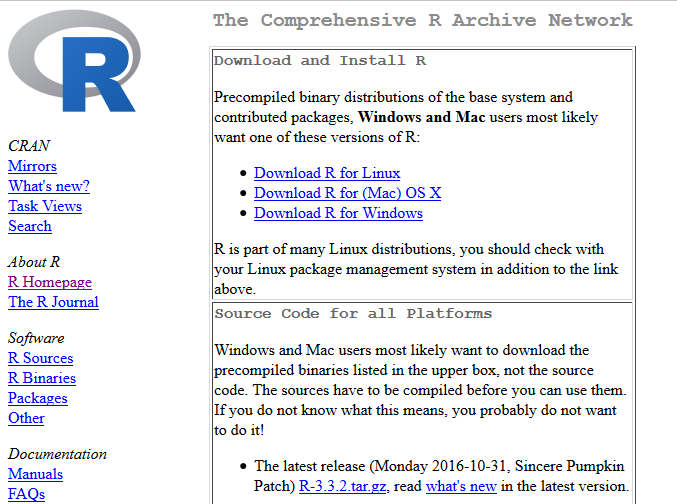

# Instalación de R {#instalacion}


```{r , child = '_global_options.Rmd'}
```


En la web del proyecto R
([www.r-project.org](http://www.r-project.org)) está disponible
mucha información sobre este entorno estadístico.


----------------------------------------   ------------------------------------
 {width="80%"}     {width="70%"}
   [R-project](https://r-project.org)       [CRAN](https://cran.r-project.org) 
----------------------------------------   ------------------------------------

Las descargas se realizan a través de la web del CRAN (The Comprehensive
R Archive Network), con múltiples mirrors:

-  *Oficina de software libre* (CIXUG) [ftp.cixug.es/CRAN](http://ftp.cixug.es/CRAN/).
-  *Spanish National Research Network (Madrid)* (RedIRIS) es
[cran.es.r-project.org](http://cran.es.r-project.org/).


Instalación de R en Windows
---------------------------

Seleccionando [Download R for Windows](http://ftp.cixug.es/CRAN/bin/windows/) y posteriormente
[base](http://ftp.cixug.es/CRAN/bin/windows/base/) accedemos
al enlace con el instalador de R para Windows (actualmente de la versión
[3.6.1](http://ftp.cixug.es/CRAN/bin/windows/base/R-3.6.1-win.exe)).

{width="40%"}
    

### Asistente de instalación

Durante el proceso de instalación la recomendación (para evitar posibles
problemas) es seleccionar ventanas simples SDI en lugar de múltiples
ventanas MDI (hay que *utilizar opciones de configuración*).

--------------------------------------   --------------------------------------
 {width="95%"}     {width="95%"}
 {width="95%"}     {width="95%"}
--------------------------------------   --------------------------------------

Una vez terminada la instalación, al abrir el programa `R`, aparece la
ventana de la consola (simula una ventana de comandos de Unix) que permite 
ejecutar comandos de R al irlos introduciendo.


### Instalación de paquetes

Después de la instalación de R, puede ser necesario instalar paquetes
adicionales.

Para ejecutar los ejemplos mostrados en el libro será necesario tener instalados los siguientes paquetes:
[`lattice`](https://cran.r-project.org/web/packages/lattice/index.html), 
[`ggplot2`](https://cran.r-project.org/web/packages/ggplot2/index.html), 
[`foreign`](https://cran.r-project.org/web/packages/foreign/index.html), 
[`car`](https://cran.r-project.org/web/packages/car/index.html), 
[`leaps`](https://cran.r-project.org/web/packages/leaps/index.html), 
[`MASS`](https://cran.r-project.org/web/packages/MASS/index.html), 
[`RcmdrMisc`](https://cran.r-project.org/web/packages/RcmdrMisc/index.html), 
[`lmtest`](https://cran.r-project.org/web/packages/lmtest/index.html), 
[`glmnet`](https://cran.r-project.org/web/packages/glmnet/index.html), 
[`mgcv`](https://cran.r-project.org/web/packages/mgcv/index.html), 
[`rmarkdown`](https://cran.r-project.org/web/packages/rmarkdown/index.html), 
[`knitr`](https://cran.r-project.org/web/packages/knitr/index.html), 
[`dplyr`](https://cran.r-project.org/web/packages/dplyr/index.html).
Por ejemplo mediante el comando:
```{r eval=FALSE}
pkgs <- c("lattice", "ggplot2", "foreign", "car", "leaps", "MASS", "RcmdrMisc", 
          "lmtest", "glmnet", "mgcv", "rmarkdown", "knitr", "dplyr")

install.packages(setdiff(pkgs, installed.packages()[,"Package"]), dependencies = TRUE)
# Si aparecen errores debidos a incompatibilidades entre las versiones de los paquetes, 
# probar a ejecutar en lugar de lo anterior:
# install.packages(pkgs, dependencies=TRUE) # Instala todos...
```

(puede que haya que seleccionar el repositorio de descarga, e.g. *Spain
(Madrid)*).

La forma tradicional es esta:

1.  Se inicia R y se selecciona *Paquetes > Instalar paquetes*

2.  Se selecciona el repositorio.

3.  Se selecciona el paquete y automáticamente se instala.

Alternativamente se podrían instalar los siguientes paquetes: `Rcmdr`,
`RcmdrPlugin.FactoMineR`, `dplyr` y `rattle`, ya que sus dependencias
incluyen los empleados en este libro.
La instalación de los paquetes `Rcmdr` y `rattle` (que incluyen interfaces gráficas) se describe 
en el Apéndice \@ref(interfaces). 

