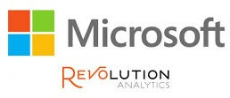

# Compañías que usan `R`

```{r , child = '_global_options.Rmd'}
```

Cada vez son más las empresas que utilizan `R`.

- Grupo de empresas que apoyan a la Fundación R y a la comunidad R.

    {width="40%"}
    

- Otras compañías:

    - Facebook, Twitter, Bank of America, Monsanto, ...


## Microsoft

{width="20%"}

- Diseñado para entornos Big Data y computación de altas prestaciones.

- Versión de R con rendimiento mejorado.

    - Microsoft R Application Network:
    
        MRAN: https://mran.microsoft.com

- Integracion de R con: SQL Server, PowerBI, Azure y Cortana
  Analytics.

## RStudio {#rstudio-com}

{width="40%"}

Además del entorno de desarrollo (IDE) con múltiples herramientas,
descrito en el Apéndice \@ref(rstudio):
    
- Interfaz web que permite ejecutar RStudio en el servidor.

    - Evita el movimiento de datos a los clientes.

    - Ediciones Open Source y Professional.

- Compañía muy activa en el desarrollo de R:

    - Múltiples paquetes: Shiny, rmarkdown, knitr, ggplot2, dplyr, tidyr, ...

    - Hadley Wickham (Jefe científico de RStudio).
    
Ver enlaces en el Apéndice \@ref(rstudio-links).
